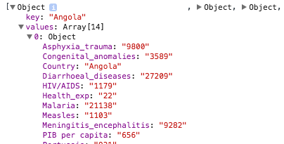

# Week 7: Improving Line Charts, Click Events, Data Transitions


## Homework Review


Some great linecharts:

* Luying: http://bl.ocks.org/luluwuluying/raw/c3c703286bf4ceb4ea6a/
* Cibonay: http://bl.ocks.org/cibonaydames/raw/9de111eb13d416d52529/
* Sunny: http://bl.ocks.org/sunnyuxuan/raw/744270264b87f58d13a1/
* Missing labels but still awesome: http://bl.ocks.org/JenHLab/raw/f6086f8147873d3493be/
* Josh: http://bl.ocks.org/CafeConVega/ed643eefaee0879d3947
* Sherman: http://bl.ocks.org/SHewitt95/raw/cf838616690e0a0bda3d/

## More D3/JS Convenience Functions

### Gridlines How To

See this article: http://www.d3noob.org/2013/01/adding-grid-lines-to-d3js-graph.html

````
var xAxis = d3.svg.axis()
    .scale(xScale)
    .tickSize(-height) // this trick makes the inner ticks into lines!
    .orient("bottom")
    .ticks(8)
    .tickFormat(function(d) {
        return dateFormat(d);
    })
    .outerTickSize([0]);

var yAxis = d3.svg.axis()
    .scale(yScale)
    .tickSize(width) // also here!
    .orient("right")
    .outerTickSize([0])
    .ticks(5);
````

###D3 Nest

This data set is long-form, with a column for country, and another for year.  Grouping by country is the most useful way to handle it for plotting it.  You can see an excerpt in **[data/deaths_04yearsold_excerpt.csv](data/deaths_04yearsold_excerpt.csv).**

````
var dataset =  d3.nest()
                .key(function(d) {
                    return d.Country;
                })
                .sortValues(function (a, b) { return dateFormat.parse(a.Year) - dateFormat.parse(b.Year)})
                .entries(data);
````

The result is object with keys (whatever you said was your key) and a values array of your original data that look like:



See **[lines_d3nest.html](lines_d3nest.html)** for how to deal with this, to group by country and then plot the lines.

The basic gist of using a nested dataset in a line plot is that you pass the array `[ d.values ]` in as the data containing the x and y data items you will be plotting.  Your line function defines which data attributes to use for the x and the y!

There are also d3 functions to return just the keys -- d3.keys(), and just the values: d3.values().

Reference:

* Read: http://learnjsdata.com/group_data.html
* See examples here: http://bl.ocks.org/phoebebright/raw/3176159/.
* See another working code example in **lines_transition.html.**


### array.filter

A useful function to "filter" an array down to only items that match your test. The result is a new array containing only those items. This one will filter an array of objects by key and find only the object with the key that is "Angola."

````
// reduces the dataset to only items that match the 'test':
var angolaObj = dataset.filter(function (d) {
                            return d.key == "Angola"
                        });
// result is an array with a single object: [Object]
````

### More Data Munging Help

Don't forget to browse through the D3 arrays help page: https://github.com/mbostock/d3/wiki/Arrays.
And you can always use http://learnjsdata.com.

For really professional data "munging" helpers, you can use lodash.js (an extension of the popular underscore.js library): https://lodash.com/docs.


## More on Lines: Improving the UI

### Labeling Lines


The key item in labeling the last point of a line is getting at the last element in your data array.  You need those X and Y data values to position the text. You can use the length of the array to do that, except subtract 1 because of starting at 0:

````
data[data.length - 1]
````

There are a few ways you can position the text labels.

The 2 examples I gave you used "transform" and "translate" to position the labels.  You could also just use the x and y scales directly, like shown in the new example: [emissions_lineplot_label.html](../Week6/emissions_lineplot_label.html).  This is similar to the example in D3 Noob's [post](http://bl.ocks.org/d3noob/8603837).

Also see my [multiple_lines_labels.html](multiple_lines_labels.html).It requires checking for empty values in the data set, or it errors. I also used a y-axis threshold to set which lines get labelled, which works with this data because those "high" lines are quite separate from each other.


### Replicating the NYT David Bowie Vis: Labels Appear on Hover

I decided to add an example showing you how to remake the [NYT David Bowie songs piece](http://www.nytimes.com/interactive/2016/01/12/upshot/david-bowie-songs-that-fans-are-listening-most-heroes-starman-major-tom.html?_r=0) I showed last week.

See [multiple_lines_labels_hover.html](multiple_lines_labels_hover.html).  The trick here is that the mouse actions are on the "g" parent that contains the line and the text label.  Because we detect the mouseover at the "g", it makes it easy to select(this) and then select the line and text underneath:

````
var groups = svg.selectAll("g")
                    .data(dataset)
                    .enter()
                    .append("g")
                    .on("mouseover", mouseoverFunc)  // putting these on the g nodes gets us a lot!
                    .on("mouseout", mouseoutFunc);

....
function mouseoverFunc(d) {
    // the "this" is the g parent node.  That means we can select it, and then select
    // the child nodes and style the]m as we want for the hover effect!
    d3.select(this).select("path").attr("id", "focused"); // overrides the class
    d3.select(this).select("text").classed("hidden", false);  // show it if "hidden"
    d3.select(this).select("text").classed("bolder", true);
    }

function mouseoutFunc(d) {
    d3.select(this).select("path").attr("id", null); // remove the focus style
    d3.select(this).select("text").classed("bolder", false); // remove the bolding on label
    // rehide the ones that are in the low numbers
    if (+d.emissions[d.emissions.length-1].amount <= 700000) {
        d3.select(this).select("text").classed("hidden", true);
    }
}
````

Notice how we select something, and then we can select something more specific under it!


### Lines with Dots and Paths, for Improved Tooltips

The file **[emissions_linescatterplot.html](emissions_linescatterplot.html)** has both dots and the line connecting them. The dots allow more detailed tooltips, if we want them. Check them out.

You have the option of having your dots be visible or not on the line.  Just change the dot opacity as you like.

I also added the dots on **[multiple_lines_labels.html](multiple_lines_labels.html).**  Notice it's hard to grab the dots and lines sometimes. See the next section below for the advanced tool trick to deal with that.

By popular demand, this is how you might structure your code to do a highlight of the line when you hover over a dot and show a tooltip: See **[multiple_lines_labels_tooltips.html](multiple_lines_labels_tooltips.html)**.  The example uses an id that matches on the line and circle, to make it easier to select the line from the circle.

Here's another alternative, tricky way to add a dot on the line at the point closest to the mouse:

* Clever line bisect mouseover label trick from Mike Bostock: http://bl.ocks.org/mbostock/3902569
* More explanation: http://www.d3noob.org/2014/07/my-favourite-tooltip-method-for-line.html

### An Alternate Line Data Structure

Because it's hard to deal with lines without any attributes, especially for styling, another way to structure the code is shown in **[lines_with_more_data.html](lines_with_more_data.html).**  This structure made it easier to style one line based on country name.

````
var lines = svg.selectAll("path.line")
                .data(dataset) // it has to be an array for the line function
                .enter()
                .append("path")
                .attr("d", function (d) {
                    return line(d.emissions); // the line is given the array it needs now
                })
                .attr("class", function (d) {
                    if (d.country === "China") {
                        return "highlight";
                    } else {
                        return "line";
                    }
                });
````

(There are still tooltips on dots, but those are in separate groups, handled as you saw above.)


### Usability Advanced Maneuvers: Lines and Scatters with Voronoi

The problem of lots of lines and/or dots is that it's hard to pick them out of the mess.  There is a technique to improve this problem, but it requires restructuring your vis quite a bit.  The solution is to add a "voronoi" grid overlay that you attach the mouse events to, so the user doesn't have to be "right over" the mouse target to trigger the tooltip.  The closest element will instead display the data.

You don't have to use this, but it's good to know about the solution when you're working with a lot of data.

Reference and how-to's:

* Read: http://www.visualcinnamon.com/2015/07/voronoi.html (notice she uses another tooltip method, the Bootstrap lib's jquery method.)
* Demo: Multi-Line Voronoi: http://bl.ocks.org/mbostock/8033015, updated to http://bl.ocks.org/curran/6c0ce7a12c7d5497350d. (He has to nest data at the same points to prevent issues with coincident points. We may have this issue in our data too.)
* An update for 2015 data: http://bl.ocks.org/curran/6c0ce7a12c7d5497350d
* Demo: Zan Armstrong's temperature lines: http://bl.ocks.org/zanarmstrong/38d7f79f61a03acc0ef0
* Demo: Picking on a bubble chart, plus animated transition: http://www.nytimes.com/interactive/2013/05/25/sunday-review/corporate-taxes.html
* Example: Voronoi beer map: http://www.washingtonpost.com/news/wonkblog/wp/2015/10/06/find-out-which-beer-is-made-closest-to-you-with-this-crazy-map/?utm_content=buffer91ba0&utm_medium=social&utm_source=twitter.com&utm_campaign=buffer

Voronoi airport maps:

* US Airports: http://bl.ocks.org/mbostock/4360892
* Arc Aiport map: http://bl.ocks.org/mbostock/7608400, https://mbostock.github.io/d3/talk/20111116/airports.html
* World Airports: https://www.jasondavies.com/maps/voronoi/airports/
* World Capitals: https://www.jasondavies.com/maps/voronoi/capitals/

Example by me: [multiple_lines_voronoi.html](multiple_lines_voronoi.html).  (TODO: Highlight line as well.)


### Fun: Lines with Interpolation

If you want smooth lines, you can use interpolation functions. Here is a demo of line interpolators in d3: http://bl.ocks.org/mbostock/4342190

Beware: Smoothing lines will distort the "true" values.  Sometimes this matters.

See data examples here: http://www.d3noob.org/2013/01/smoothing-out-lines-in-d3js.html?spref=tw

We will do animated lines in an upcoming week.


## Transitions in D3 and Click Events


### D3 Transitions

Transitions allow us to animate changes of properties in code.

**Read**:

* Updating data, transitions, etc: http://chimera.labs.oreilly.com/books/1230000000345/ch09.html#_updating_data (as far as "Other Kinds of Data Updates")
* Optional: http://blog.visual.ly/creating-animations-and-transitions-with-d3-js/
* Working with Transitions: http://bost.ocks.org/mike/transition/
* Optional Academic Research: http://vis.berkeley.edu/papers/animated_transitions/

See the transition with a delay by dot in **[scatter_transition_in.html](scatter_transition_in.html)**:

````
// adding a silly intro animation to catch the eye -- using transition:
circles.sort(function(a, b) {
        return d3.ascending(+a.educationalAttainment, +b.educationalAttainment);
    })
    .transition()
    .delay(function(d, i) {
        return i * 10;
    })
    .duration(500)
    .attr("r", dotRadius);
````

Also, [scatter_transition_move_in_slow.html](scatter_transition_move_in_slow.html), which differs slightly! This time it moves from the lower left as a mass.

In the file **[emissions_linescatterplot.html](emissions_linescatterplot.html)**, we have added a mouseover transition:

````
// grow the dot to larger radius on mouseover
    circles.on("mouseover", function(d) {
        d3.select(this)
            .transition()
            .duration(50)
            .attr("r", 7);
    })
// go back to the old size on mouseout!
    .on("mouseout", function (d) {
        d3.select(this)
            .transition()
            .attr("r", 3);
    });
````

There are more data-oriented transitions in **[scatter_data_transition.html](scatter_data_transition.html)** and **[lines_transition.html](lines_transition.html)**.  See below for the click events part.


### Transitions on "Click" Events

For a first, simple click event transition, look at **[scatter_data_transition.html](scatter_data_transition.html).**

When the paragraph element with the class is clicked, a transition changes the data elements in the scatter plots.  The title changes too.  Notice the highlighted elements - they are outliers and a middle point in the first display, but you can see where they end up when you click the red text.

That code is structured poorly and can only be run once. So it won't toggle back and forth.

There is a toggle button version in [scatter_data_transition_toggle.html](scatter_data_transition_toggle.html).  The code for handle the switch of the data values is just a lot of if-statements checking on the current value of the clicked button.

We check the value using these tricks:

````
<button class="clicker" id="toys">Show Toys!</button>
<button class="clicker" id="books">Show Books!</button>
...
d3.selectAll("button.clicker").on("click", function() {

    // we use the id attr on each to see which data set to use.
    var whichbutton = d3.select(this).attr("id");
    // whichbutton will now be set to either "toys" or "books"
...
````

Now let's look at the more complex **[lines_transition.html](lines_transition.html)**.  (Note: It may take a while to load initially.)

In it we use buttons that swap the data on a line chart!  (We're also using Bootstrap for some CSS layout and a map image.)

````
d3.selectAll("button").on("click", function() {
    var selectedline = d3.select("path.line");
    var thisButton = d3.select(this);  // "this" is what was clicked
    // Here we get the id value for the button, and use that to get a new data set!
    var newdata = get_values_for_country(thisButton.attr("id"));  // the id has to match the country name for this to work.

    // style the selected button only
    d3.selectAll("button").classed("selected", false);
    thisButton.classed("selected", true);
    // transition the line to the new dataset:
    selectedline.transition().attr("d", line(newdata));
````

Review: **[lines_transition.html](lines_transition.html)**


### Country Regions Line Chart Example

This is much prettier than my mockup above, and does similar things to what some of you wanted to do in the homework and now is possible with our buttons (or other UI elements).

**Nathan Yau**: http://projects.flowingdata.com/life-expectancy/.

The tutorial requires membership; see me. (Also, the code is a little out of date.)

He uses jquery for the "button" fiters - we will use d3 below, but either is fine.

````
    $('#filters a').click(function() {
        var countryId = $(this).attr("id");
        $(this).toggleClass(countryId);
        showRegion(countryId);
    });
````
And the code for showing regions is going to look familiar:

````
function showRegion(regionCode) {
    var countries = d3.selectAll("path."+regionCode);
    if (countries.classed("highlight")) {
        countries.attr("class", regionCode);
    } else {
        countries.classed("highlight", true);
    }
}
````

He uses a variable with lookups for the region full names:
````
var regions = { "SAS": "South Asia" , "ECS": "Europe and Central Asia", "MEA": "Middle East & North Africa", "SSF": "Sub-Saharan Africa", "LCN": "Latin America & Caribbean", "EAS": "East Asia &amp; Pacific", "NAC": "North America" },
````

And he builds a lookup table for each country / region using the abbreviations. Then he can use the country code to get the region code and use it as a class on the line:

````
vis.append("svg:path")  // this is out of date - we don't need to append "svg:" anymore
            .data([currData])
            .attr("country", countries[i][1])
            .attr("class", countries_regions[countries[i][1]]) // <-- the lookup table
            .attr("d", line)
            .on("mouseover", onmouseover)
            .on("mouseout", onmouseout);

````

In more modern D3 code, we'd use a d3.map() hash lookup for the country code region lookup. You'll see some examples in upcoming weeks.


## FYI: Bootstrap for CSS layouts

Have a look at Bootstrap, in very common usage in industry:

* http://getbootstrap.com/
* http://getbootstrap.com/css/
* http://getbootstrap.com/css/#grid

You will use it in one of your homeworks.  I used it for the [lines_transition.html](lines_transition.html) layout which admittedly is still an ugly page.

Reminder: Don't use a ".tooltip" class for your D3 tooltips with Bootstrap. Change it to ".mytooltip" or something else.  Bootstrap highjacks ".tooltip" away from you.


## Recent Interesting Things

* Connected Scatterplot with Transitions: http://www.nytimes.com/interactive/2015/09/30/business/how-the-us-and-opec-drive-oil-prices.html
* Line charts in the news, the infamous Planned Parenthood graph: http://emschuch.github.io/Planned-Parenthood/

Things to encourage you, I hope:

* https://medium.com/@meandvan/how-i-learned-to-stop-worrying-and-love-the-code-af1a809457c7
* Learning D3 tips from Mike Bostock: https://medium.com/volt-data-lab/to-learn-data-visualization-look-for-small-problems-first-df34fc4630a0  (ignore all the js frameworks and buzzwords if you want, most news graphics teams that publish data insights don't use them)


## Homework

Reading

* Updating data, transitions, etc: http://chimera.labs.oreilly.com/books/1230000000345/ch09.html#_updating_data (up to "Other Kinds of Data Updates," we'll finish next week)


**Homework 1: Tooltip Dots on Lines** (20pt):

Add dots to your personal line charts (not my data!), following the model in [emissions_linescatterplot.html](emissions_linescatterplot.html) and [multiple_lines_labels.html](emissions_linescatterplot.html).  They can be visible or not, animated or not - but they should have d3 tooltips attached that show at least the x and y data values visible in them.

Send me the gist with subject/label "Dots on Lines."


**Homework 2: Transition Plot With Buttons** (30pt):

Choose a few interesting lines to plot (2 or 3, not a zillion), or a couple nice scatterplot examples. Bars would work too if you want. (You would just transition the bar width.) Pick at least 2.

You will compare the data using transitions between data set variables.  The 2 comparisons must have the same number of points (at this point in the class), no missing or extra data in one set!  Make sure you have no missing data here in one of your variables.

Using the concepts in [lines_transition.html](lines_transition.html) or [scatter_data_transition_toggle.html](scatter_data_transition_toggle.html) and in Scott's chapter on transitions, to make transitions between the data sets.  Use buttons to control them.  Use a flexible 2 column Bootstrap layout (like I did in [lines_transition.html](lines_transition.html)), with your chart in one column, and put useful text or imagery or both in the other column.  Use your own data and style!

Send me the gist with subject "Transition Plot."


